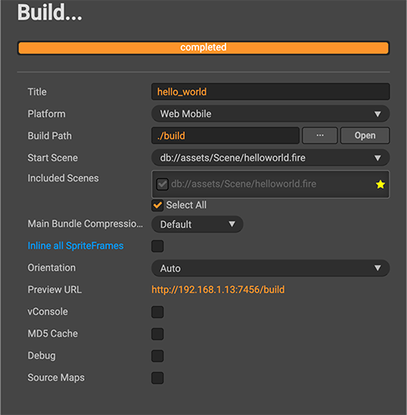

# CocosToSingleHTML5
Use cocos creator 2.4.3 to build single html5 for Playable Ad that able to use on Facebook, UnityAds , GoogleAds

###### Project based on https://github.com/mrsep18th/single_html5_generator and edit some minor code to load particle system (.plist) exactly.

Requirement:

- Cocos Creator 2.4.3 
- Install python3
- Install module simplejson,tinify ( **pip3 install simplejson**, **sudo pip3 install tinify**)
- Get apiKey on https://tinify.com/ and paste value to apiKey at html_generator/tinify_png.py

Instructions:

1. Create your project and choose build setting like that

2. Copy **build-templates** and **html_generator** folders to your project folder
3. Open terminal/cmd on html_generator folder
4. Run 'python3 generate_single_html.py True' command to generate index.html

References:

- http://www.mrsep18.com/2019/07/24/create-facebook-playable-ads-with-cocos-creator
- https://github.com/fkworld/cocos-to-playable-ad
